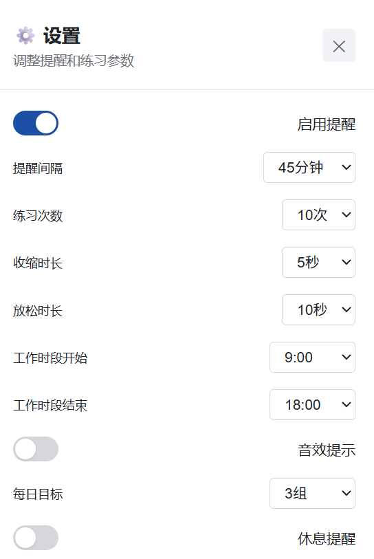
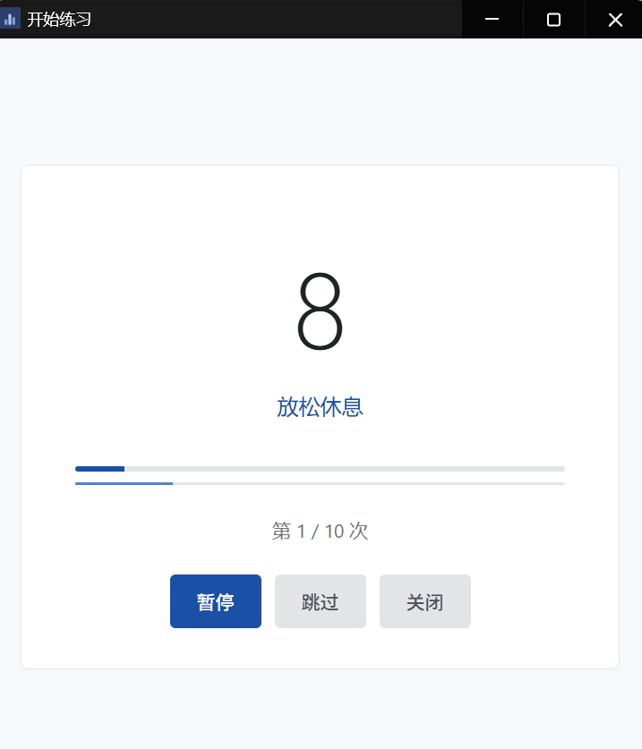
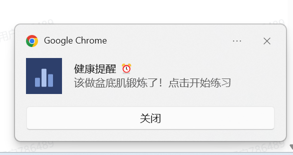

# 刚刚好 (Just Right)

> 一款专为久坐办公人员设计的健康提醒浏览器插件，定时提醒进行盆底肌锻炼（凯格尔运动）。

A browser extension that reminds sedentary office workers to do pelvic floor exercises (Kegel exercises) at regular intervals.

## ✨ 功能特点

### 核心功能
- ⏰ **定时提醒**：可自定义提醒间隔（30分钟 - 2小时），支持自定义任意时长
- 🎯 **运动指导**：详细的运动步骤说明和健康益处介绍
- 💪 **互动练习**：内置智能计时器，引导完成标准练习
- 📊 **统计追踪**：记录总练习次数、今日练习、连续天数
- 🏆 **成就系统**：6个成就徽章，激励持续练习
- 🔔 **通知提醒**：浏览器原生通知，隐私友好的提醒文案

### 进阶功能
- ⏸️ **暂停/继续/跳过**：灵活控制练习节奏
- 🎹 **键盘快捷键**：Space（暂停/继续）、S（跳过）、H（隐藏窗口）、Esc（关闭）
- 🔇 **音效提示**：可选的阶段切换音效（默认关闭）
- 🔒 **隐私模式**：隐藏所有文本，只显示计时器和进度
- 🎯 **每日目标**：设置每日练习目标，完成后自动提醒
- ☕ **休息提醒**：可选的每2小时休息提醒
- ⏰ **工作时段**：只在指定时间段内发送提醒
- 💾 **数据管理**：导出/导入数据备份，支持清空统计

## 🏥 健康益处

- 改善盆底肌功能，预防尿失禁
- 促进局部血液循环
- 缓解久坐带来的不适
- 改善性功能
- 预防痔疮等肛肠疾病

## 📦 安装方法

### Chrome / Edge 浏览器

1. 下载本插件所有文件到本地文件夹
2. 打开浏览器，进入扩展程序页面：
   - Chrome: `chrome://extensions/`
   - Edge: `edge://extensions/`
3. 开启右上角的「开发者模式」
4. 点击「加载已解压的扩展程序」
5. 选择本插件的文件夹
6. 安装完成！

## 🚀 使用说明

### 基本设置

1. 点击浏览器工具栏中的插件图标
2. 点击右上角的设置按钮（⚙️）
3. 配置：
   - 启用/禁用提醒
   - 选择提醒间隔时间（预设或自定义）
   - 设置练习参数（次数、时长）
   - 工作时段限制
   - 每日目标

### 开始练习

**方式一：点击通知**
- 当提醒通知弹出时，点击通知即可开始练习

**方式二：主动练习**
- 点击插件图标
- 点击「立即开始练习」按钮
- 跟随页面指引完成练习

### 练习控制

- **空格键**：暂停/继续
- **S键**：跳过当前次
- **H键**：快速隐藏窗口
- **Esc键**：关闭窗口

### 运动步骤

1. **准备姿势**：坐直或平躺，全身放松，保持自然呼吸
2. **收缩盆底肌**：像憋尿、憋便那样收紧肛门和会阴部，保持5-10秒
3. **放松休息**：完全放松盆底肌肉，休息10秒
4. **重复练习**：重复以上动作10-15次为一组

## 📸 界面预览

<table>
  <tr>
    <td width="50%">
      
      <p align="center"><em>主界面 - 统计数据和成就系统</em></p>
    </td>
    <td width="50%">
      
      <p align="center"><em>设置页面 - 灵活的配置选项</em></p>
    </td>
  </tr>
  <tr>
    <td width="50%">
      
    </td>
    <td width="50%">
      
    </td>
  </tr>
</table>


## 📁 文件结构

```
刚刚好/
├── manifest.json          # 插件配置文件
├── background.js          # 后台服务脚本
├── popup.html             # 主界面
├── popup.js               # 主界面逻辑
├── settings.html          # 设置页面
├── settings.js            # 设置逻辑
├── help.html              # 帮助页面
├── help.js                # 帮助逻辑
├── exercise.html          # 练习界面
├── exercise.js            # 练习计时器逻辑
├── popup.css              # 样式文件
├── icons/                 # 图标目录
│   ├── icon16.png
│   ├── icon48.png
│   └── icon128.png
├── screenshots/           # 界面截图
│   ├── 1.png
│   ├── 2.png
│   ├── 3.png
│   └── 4.png
└── README.md              # 说明文档
```

## 🛠️ 技术实现

- **Manifest V3**：使用最新的浏览器插件标准
- **Chrome Alarms API**：实现精确的定时提醒
- **Notifications API**：发送系统级通知
- **Storage API**：跨设备同步用户设置和数据
- **Web Audio API**：生成阶段切换音效
- **纯原生实现**：无需任何外部依赖
- **OKLCH颜色系统**：专业的设计美学
- **隐私优先**：通知内容不泄露敏感信息

## 🎯 成就系统

- 🌱 **初次尝试**：完成首次练习
- 📅 **坚持7天**：连续7天练习
- 🏆 **满月成就**：连续30天练习
- 💯 **百炼成钢**：累计100次练习
- ⭐ **勤奋之星**：单日完成5次
- 🔥 **热情不减**：连续14天练习

## 💡 建议使用频率

- 每天练习 3-5 组
- 每组 10-15 次
- 建议间隔 45-60 分钟
- 持之以恒效果更佳

## ⚠️ 注意事项

**重要提示**：
- 本插件仅提供运动提醒和指导，不构成医疗建议
- 如有相关疾病，请咨询医生后再进行练习
- 孕期、产后等特殊时期请遵医嘱
- 练习时应该感到舒适，如有不适请停止

## 🔐 隐私说明

- 所有数据仅存储在本地浏览器中
- 使用chrome.storage.sync时数据通过Google账号同步（可选）
- 不收集、不上传任何个人信息
- 通知内容使用隐私友好的文案，不泄露具体练习内容

## 📄 开源协议

MIT License - 欢迎使用和修改

## 🤝 反馈建议

如有问题或建议，欢迎提交 Issue 或 Pull Request。

---

## English

**Just Right** is a browser extension designed for office workers who sit for extended periods. It provides timed reminders to perform pelvic floor muscle exercises (Kegel exercises), helping improve health and prevent issues related to prolonged sitting.

### Features
- ⏰ Customizable reminder intervals (30 min - 2 hours, or custom)
- 💪 Guided exercise routine with smart timer
- 📊 Statistics tracking (total sessions, today's count, streak)
- 🏆 6 achievement badges to motivate consistency
- 🔔 Privacy-friendly native browser notifications
- ⏸️ Pause/Resume/Skip controls with keyboard shortcuts
- 🔒 Privacy mode to hide all text during exercise
- 💾 Data export/import for backup
- ☕ Optional break reminder every 2 hours
- ⏰ Work hours configuration

### Privacy-First Design
- All data stored locally in browser
- Notification content is discreet and privacy-friendly
- No data collection or external uploads
- Optional privacy mode for complete discretion

---

💪 **关爱健康，从现在开始！Stay healthy, starting now!**
